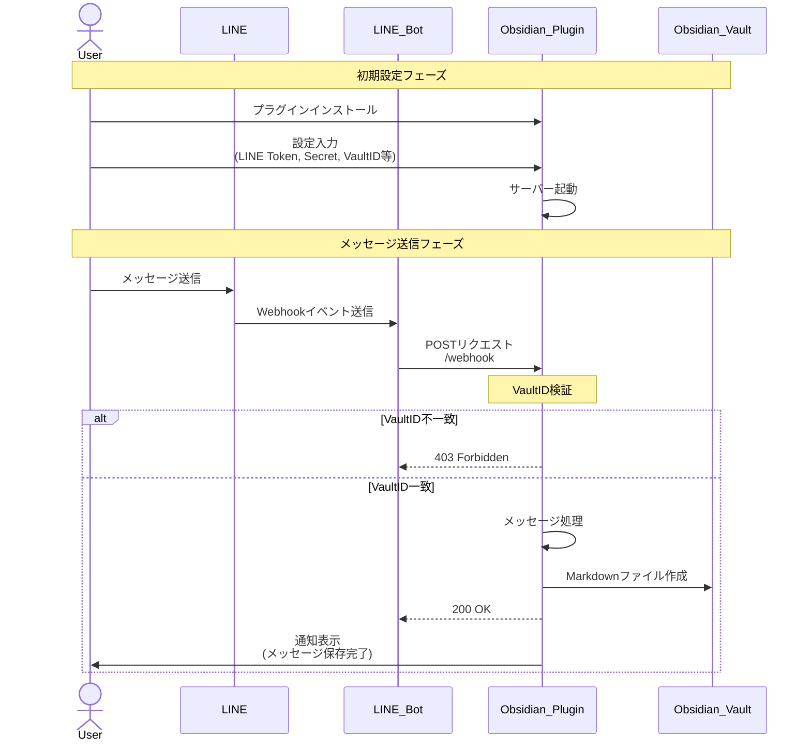

# LINE to Obsidian シーケンス図

このドキュメントでは、LINEメッセージからObsidianへの保存までの流れを説明します。

## システム構成図

## フローの説明

### 初期設定フェーズ
1. ユーザーがObsidianプラグインをインストール
2. プラグイン設定で必要な情報を入力
   - LINE Channel Access Token
   - LINE Channel Secret
   - Vault ID
   - サーバーポート番号
   - 保存先フォルダパス
3. プラグインがローカルサーバーを起動

### メッセージ送信フェーズ
1. ユーザーがLINEでメッセージを送信
2. LINEがWebhookイベントをLINE Botに送信
3. LINE BotがObsidianプラグインのWebhookエンドポイントにPOSTリクエスト
4. プラグインがVault IDを検証
   - 不一致の場合：403エラーを返す
   - 一致の場合：
     - メッセージを処理
     - Markdownファイルを作成
     - 200 OKを返す
     - ユーザーに通知を表示

## 重要なポイント
- すべてのメッセージはVault IDによって適切なObsidian Vaultに振り分けられる
- メッセージの保存は非同期で行われる
- エラーが発生した場合でも、LINEボットには適切なレスポンスが返される
- ユーザーは保存完了時に通知を受け取る 